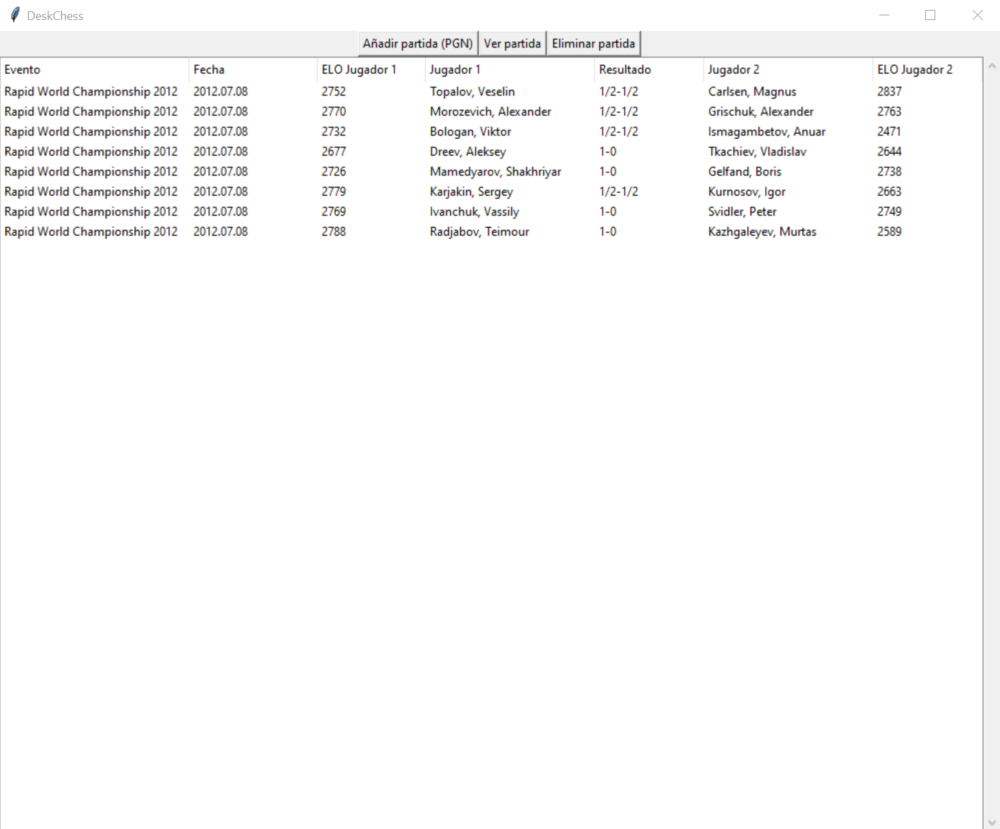
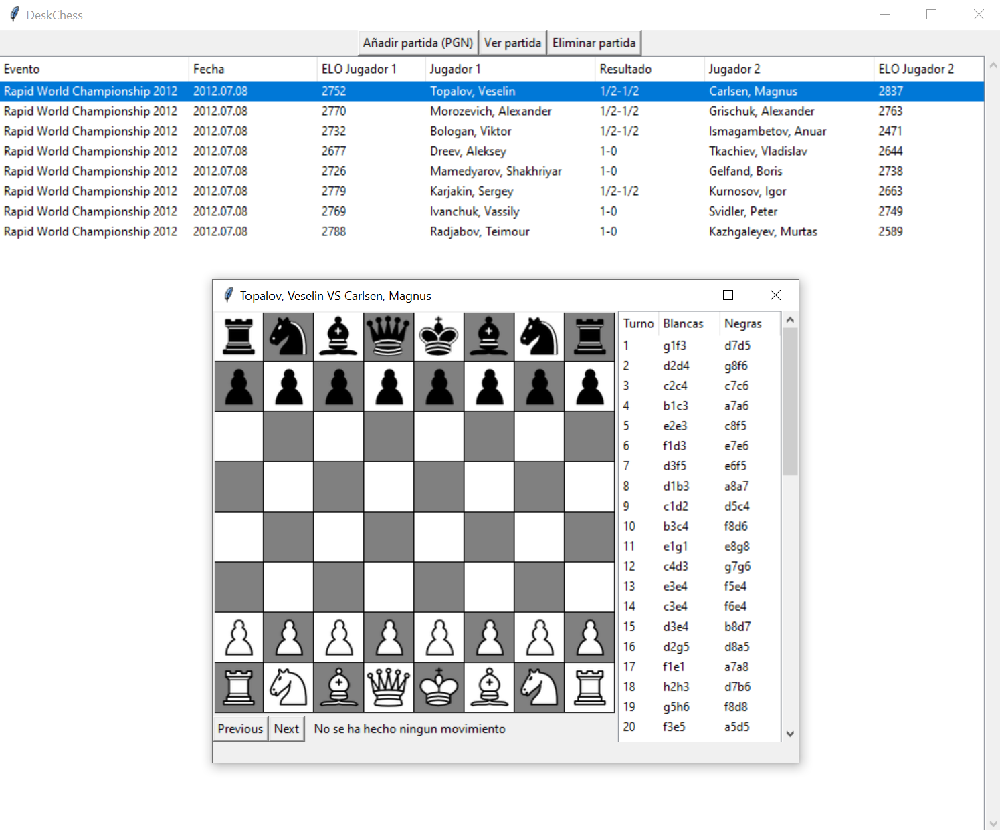
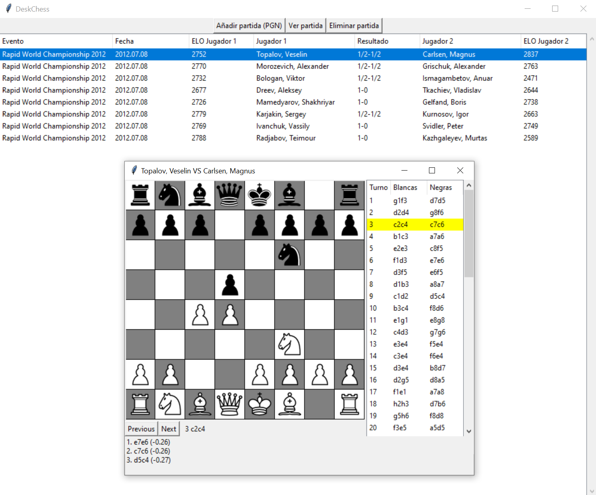

# DeskChess

DeskChess: Base de Datos de partidas de ajedrez que ofrece almacenamiento y visualización de partidas, ademas de estadísticas detalladas sobre jugadores.


[](https://www.codefactor.io/repository/github/jfrozas/DeskChess)

[](https://codecov.io/gh/jfrozas/DeskChess)


## Funcionalidades

- Carga y almacenamiento de partidas en formato PGN.
- Visualización de partidas, con posible interacción de módulo para análisis.
- Generación de estadísticas de los jugadores en la Base de Datos:
  
    - Partidas totales
    - Partidas ganadas, perdidas y empatadas
    - Aperturas mas jugadas


## Requisitos

python-chess

Pillow

tkinter

sqlite3

Normalmente tkinter y sqlite ya vienen instaladas con la distribución de python.

```bash
pip install -r requirements.txt
```

## Uso

Cuando se ejecuta el programa

```bash
python main.py
```

Se abrira una ventana de la siguiente forma:



En esta, se pueden ver 3 botones. Si se selecciona añadir partida, se dejará seleccionar un fichero .pgn para añadirlo a la Base de Datos. Este puede tener una o más partidas.

Si se selecciona una partida (Click izquierdo sobre esta), y se selecciona eliminar, se eliminará de la Base de Datos.

Por último, si se selecciona una partida, y se clicka en ver partida, se abrirá una nueva ventana  de la forma:



En esta, se puede ver la partida, los movimientos, y movernos hacia adelante o atrás en estos, los cuales serán reflejados en el tablero.

Cuando se haga el primer movimiento, también aparecerán en la pantalla los tres mejores movimientos para esa posición, además de una puntuación aproximada de esta, dada por el módulo Stockfish.


